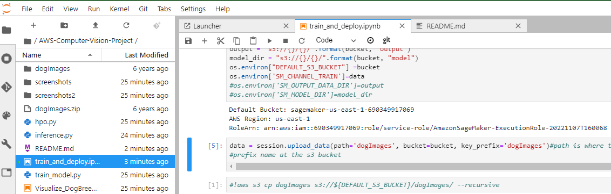
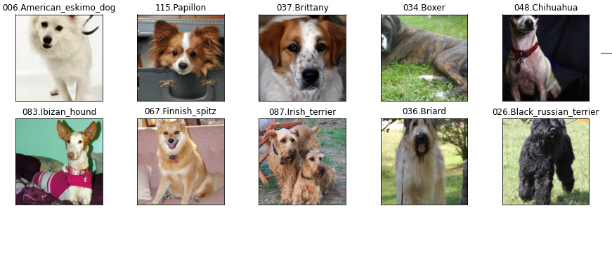
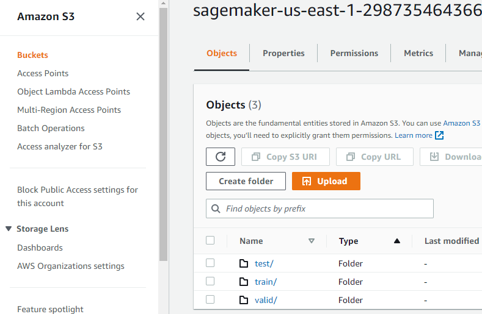
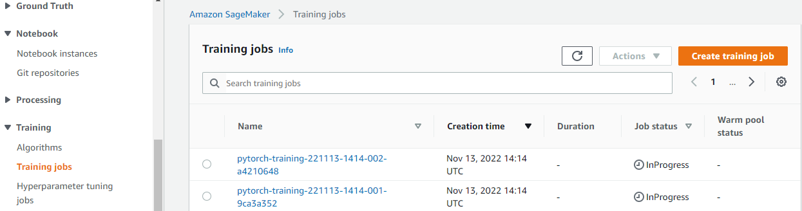
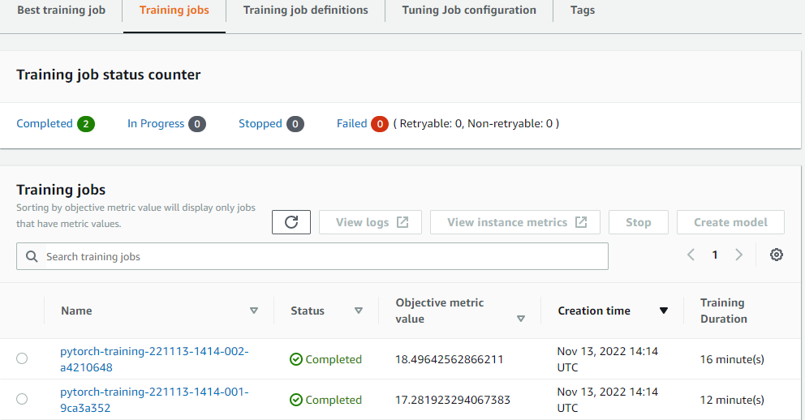
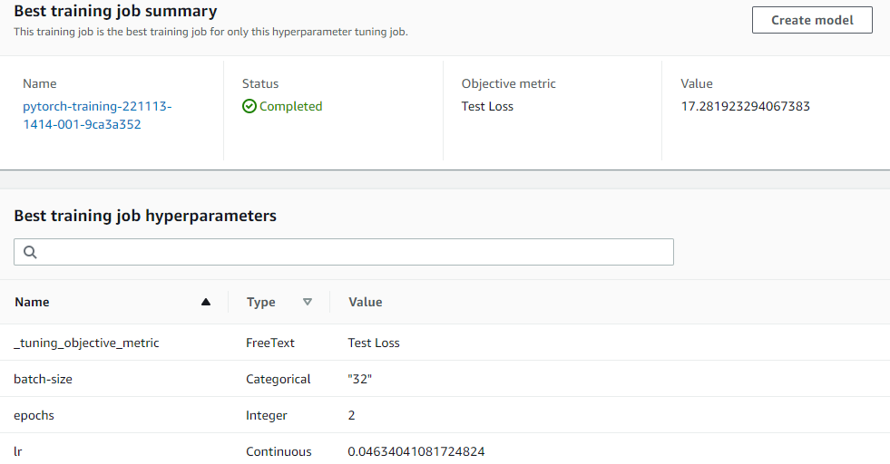
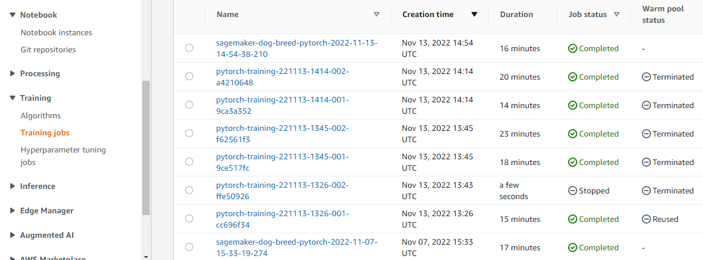
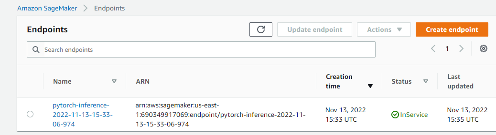

# Image Classification using AWS SageMaker


Use AWS Sagemaker to train a pretrained model that can perform image classification by using the Sagemaker profiling, debugger, hyperparameter tuning and other good ML engineering practices. This can be done on either the provided dog breed classication data set or one of your choice.

## Project Set Up and Installation
Enter AWS through the gateway in the course and open SageMaker Studio. 
Download the starter files.
Download/Make the dataset available. 

The sagemaker notebook instance used is ```ml.t3.medium``` with vCPU 2 and 4 GiB memory

## Dataset
The provided dataset is the dogbreed classification dataset which can be found in the classroom.
The project is designed to be dataset independent so if there is a dataset that is more interesting or relevant to your work, you are welcome to use it to complete the project.

The dataset is from dogbreed.
extract dataset from the url and unzip it.
```py
!wget https://s3-us-west-1.amazonaws.com/udacity-aind/dog-project/dogImages.zip
!unzip dogImages.zip
```



The dataset has 133 classes of different dogbreeds.
see the zip file dogImages.zip and folder dogImages which was unzipped.

**Transform Image**
```py
# transforms for images
transforms = torchvision.transforms.Compose([
    torchvision.transforms.Resize(256),
    torchvision.transforms.CenterCrop(224),
    torchvision.transforms.ToTensor(),
    torchvision.transforms.RandomHorizontalFlip(p = 0.5)
])

# datasets
trainset = torchvision.datasets.ImageFolder(train_dir, transform = transforms)
#batches
batch_size = 128

# loaders for data
trainloader = torch.utils.data.DataLoader(trainset , batch_size=batch_size , shuffle = True)
images, labels = iter(trainloader).next()
images, labels = images.numpy() , labels.numpy()

fig = plt.figure(figsize = (15,5))

for i in range(10):#range(int(batch_size/8)):
    ax = fig.add_subplot(2 , 5 , i+1 , xticks = [] , yticks = [])                                                            
    ax.imshow(np.transpose(images[i] , (1,2,0)) , cmap = 'gray')
    ax.set_title(trainset.classes[labels[i]])
```


Upload data to S3
```py
data = session.upload_data(path='dogImages', bucket=bucket, key_prefix='dogImages')

```


### Access
Upload the data to an S3 bucket through the AWS Gateway so that SageMaker has access to the data. 

## Hyperparameter Tuning
What kind of model did you choose for this experiment and why? Give an overview of the types of parameters and their ranges used for the hyperparameter search

Remember that your README should:
- Include a screenshot of completed training jobs
- Logs metrics during the training process
- Tune at least two hyperparameters
- Retrieve the best best hyperparameters from all your training jobs

**Metrics**

```py
hyperparameter_ranges = {
    "lr": ContinuousParameter(0.01, 0.1), #CategoricalParameter(0.01),
    "batch-size": CategoricalParameter([32, 64]),
    "epochs": IntegerParameter(1, 4)
}

'''
objective_metric_name = "Test Loss"
objective_type = "Minimize"
metric_definitions = [{"Name": "Test Loss", "Regex": "Testing Loss: ([0-9\\.]+)"}]

'''
# Using accuracy measure this time.
objective_metric_name = 'val_acc'
objective_type = 'Maximize'
metric_definitions = [{'Name': 'val_acc', 'Regex': 'val_acc: ([0-9\\.]+)'}]

```

**Model**
Using Pytorch Model which is a deeplearning frame work,

Also 
```py
#TODO: Create estimators for your HPs

estimator = PyTorch(
    entry_point="hpo.py",
    role=get_execution_role(),
    py_version='py36',
    framework_version="1.8",
    instance_count=1,
    instance_type='ml.m4.xlarge'#,
    #hyperparameters=hyperparameters
)# TODO: Your estimator here

tuner = HyperparameterTuner(
    estimator,
    objective_metric_name,
    hyperparameter_ranges,
    metric_definitions,
    max_jobs=2,
    max_parallel_jobs=2,
    objective_type=objective_type,
    early_stopping_type="Auto"
)# TODO: Your HP tuner here
```



See 2 Jobs created from hyperparameterTuner.






extract best model parameters.
```py
batch_size=int(best_estimator.hyperparameters()['batch-size'].replace('"',''))
epochs=best_estimator.hyperparameters()['epochs']
learn_r=best_estimator.hyperparameters()['lr'].replace('"','')
```



Attaching a training job.
```py
TrainingJobName='sagemaker-dog-breed-pytorch-2022-11-07-15-33-19-274'
my_estimator = sagemaker.estimator.Estimator.attach(TrainingJobName)
my_estimator.hyperparameters()
estimator=my_estimator
estimator
```

## Debugging and Profiling
**TODO**: Give an overview of how you performed model debugging and profiling in Sagemaker


### Results
**TODO**: What are the results/insights did you get by profiling/debugging your model?

**TODO** Remember to provide the profiler html/pdf file in your submission.


## Model Deployment
**TODO**: Give an overview of the deployed model and instructions on how to query the endpoint with a sample input.

**TODO** Remember to provide a screenshot of the deployed active endpoint in Sagemaker.



## Standout Suggestions
**TODO (Optional):** This is where you can provide information about any standout suggestions that you have attempted.


## Reference

[Debugger](https://github.com/aws/amazon-sagemaker-examples/blob/main/sagemaker-debugger/pytorch_model_debugging/pytorch_script_change_smdebug.ipynb)
[hyperparameter Tuning](https://sagemaker-examples.readthedocs.io/en/latest/hyperparameter_tuning/pytorch_mnist/hpo_pytorch_mnist.html)

[Using PyTorch](https://sagemaker.readthedocs.io/en/stable/frameworks/pytorch/using_pytorch.html)
