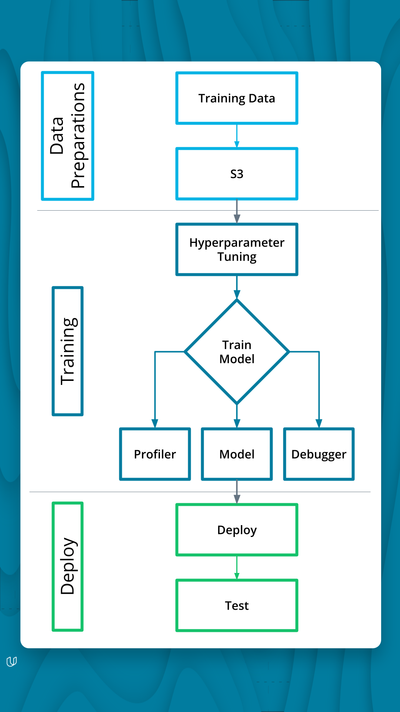

# Image Classification using AWS SageMaker



I used AWS Sagemaker to train a pretrained model that can perform image classification by using the Sagemaker profiling, debugger, hyperparameter tuning and other good ML engineering practices. This can be done on either the provided dog breed classication data set or one of your choice.

## Project Set Up and Installation

The sagemaker notebook instance used is ```ml.t3.medium``` with vCPU 2 and 4 GiB memory

## Dataset
The provided dataset is the dogbreed classification dataset which can be found in the classroom.

The dataset is from dogbreed.
extract dataset from the url and unzip it.
```py
!wget https://s3-us-west-1.amazonaws.com/udacity-aind/dog-project/dogImages.zip
!unzip dogImages.zip
```


The dataset has 133 classes of different dogbreeds.
see the zip file dogImages.zip and folder dogImages which was unzipped.

**Transform Image**
```py
# transforms for images
transforms = torchvision.transforms.Compose([
    torchvision.transforms.Resize(256),
    torchvision.transforms.CenterCrop(224),
    torchvision.transforms.ToTensor(),
    torchvision.transforms.RandomHorizontalFlip(p = 0.5)
])

# datasets
trainset = torchvision.datasets.ImageFolder(train_dir, transform = transforms)
#batches
batch_size = 128

# loaders for data
trainloader = torch.utils.data.DataLoader(trainset , batch_size=batch_size , shuffle = True)
images, labels = iter(trainloader).next()
images, labels = images.numpy() , labels.numpy()

fig = plt.figure(figsize = (15,5))

for i in range(10):#range(int(batch_size/8)):
    ax = fig.add_subplot(2 , 5 , i+1 , xticks = [] , yticks = [])                                                            
    ax.imshow(np.transpose(images[i] , (1,2,0)) , cmap = 'gray')
    ax.set_title(trainset.classes[labels[i]])
```


### Access
Upload the data to an S3 bucket through the AWS Gateway so that SageMaker has access to the data. 
Upload data to S3
```py
data = session.upload_data(path='dogImages', bucket=bucket, key_prefix='dogImages')

```


## Hyperparameter Tuning
What kind of model did you choose for this experiment and why? Give an overview of the types of parameters and their ranges used for the hyperparameter search

Remember that your README should:
- Include a screenshot of completed training jobs
- Logs metrics during the training process
- Tune at least two hyperparameters
- Retrieve the best best hyperparameters from all your training jobs

**Metrics**


Log metrics in cloudWatch during training process

Hyperparameters:
```py
hyperparameter_ranges = {
    "lr": ContinuousParameter(0.01, 0.1), #CategoricalParameter(0.01),
    "batch-size": CategoricalParameter([32, 64]),
    "epochs": IntegerParameter(2, 4)
}

objective_metric_name = "Test Loss"
objective_type = "Minimize"
metric_definitions = [{"Name": "Test Loss", "Regex": "Testing Loss: ([0-9\\.]+)"}]

```

**Model**
Using Pytorch Model which is a deeplearning frame work,

Also 
```py
#TODO: Create estimators for your HPs

estimator = PyTorch(
    entry_point="hpo.py",
    role=get_execution_role(),
    py_version='py36',
    framework_version="1.8",
    instance_count=1,
    instance_type='ml.m4.xlarge'#,
    #hyperparameters=hyperparameters
)# TODO: Your estimator here

tuner = HyperparameterTuner(
    estimator,
    objective_metric_name,
    hyperparameter_ranges,
    metric_definitions,
    max_jobs=2,
    max_parallel_jobs=2,
    objective_type=objective_type,
    early_stopping_type="Auto"
)# TODO: Your HP tuner here
```


See 2 Jobs created from hyperparameterTuner.


extract best model parameters.
```py
batch_size=int(best_estimator.hyperparameters()['batch-size'].replace('"',''))
epochs=best_estimator.hyperparameters()['epochs']
learn_r=best_estimator.hyperparameters()['lr'].replace('"','')
```


Attaching a training job.
```py
TrainingJobName='sagemaker-dog-breed-pytorch-2022-11-07-15-33-19-274'
my_estimator = sagemaker.estimator.Estimator.attach(TrainingJobName)
my_estimator.hyperparameters()
estimator=my_estimator
estimator
```

## Debugging and Profiling

Amazon SageMaker Debugger is analysis. It allows us to perform interactive exploration of the tensors saved in real time or after the job
Create an SMDebug trial object and retrieve saved output tensors
```py
trial = create_trial(estimator.latest_job_debugger_artifacts_path())
```

We can also retrieve tensors by some default collections that smdebug creates from your training job. Here we are interested in the losses collection, so we can retrieve the names of tensors in losses collection as follows.
```py
trial.tensor_names()
```

Check the number of steps saved in the different training phases
2 steps where created in training mode, while 3 steps where created in eval mode.
```py
len(trial.tensor("CrossEntropyLoss_output_0").steps(mode=ModeKeys.TRAIN))
len(trial.tensor("CrossEntropyLoss_output_0").steps(mode=ModeKeys.EVAL))

```


The graph above shows that the model is underfitting as validation loss is greater than training loss, thus, I need to do some adjustment to my model like increase the number of epochs. Thus model did not generalize well.

### Results

* It showed that I spent that time spent between train and evaluation step is very high.
* I spent 100% of times executing the CPU function, This is because I used ```ml.m5.xlarge``` for training my model which has 4 vCPU and 16 GiB memory, thus noGPU.

During your training job, the StepOutlier rule was the most frequently triggered. It processed 164 datapoints and was triggered 2 times.
StepOutlier rule suggestion: Check if there are any bottlenecks (CPU, I/O) correlated to the step outliers.
* CPUBottleneck rule suggested to Consider increasing the number of data loaders or applying data pre-fetching, as I am using CPU for comutation.
* IOBottlenect rule which checks if IO wait time is high nd the GPU utilization is low. Suggests that I Pre-fetch data or choose different file formats, such as binary formats that improve I/O performance.
* BatchSize rule: since I used a Batch size of 32, this is too small suggestion was to Consider running on a smaller instance type or increasing the batch size.


For more details see [Profiler](profiler-report.html)


## Model Deployment

Prepare a serializer.

```py
jpeg_serializer = sagemaker.serializers.IdentitySerializer("image/jpeg")
json_deserializer = sagemaker.deserializers.JSONDeserializer()


class ImagePredictor(Predictor):
    def __init__(self, endpoint_name, sagemaker_session):
        super(ImagePredictor, self).__init__(
            endpoint_name,
            sagemaker_session=sagemaker_session,
            serializer=jpeg_serializer,
            deserializer=json_deserializer,
        )
```

```py

pytorch_model = PyTorchModel(model_data=model_location, role=role, entry_point='inference.py',py_version='py36',
                             framework_version='1.8',
                             predictor_cls=ImagePredictor)
```
The PyTorch and PyTorchModel classes repack model.tar.gz to include the inference script

inside inference.py *load model*
Before a model can be served, it must be loaded using model_fn(...)
```py
def model_fn(model_dir):
    model = models.resnet50(pretrained=True)

    for param in model.parameters():
        param.requires_grad = False

    num_features = model.fc.in_features
    model.fc = nn.Sequential(
        nn.Linear(num_features, 133))

    with open(os.path.join(model_dir, 'model.pth'), 'rb') as f:
        model.load_state_dict(torch.load(f))
    return model
```
he SageMaker PyTorch model server loads your model by invoking a model_fn function that you must provide in your script when you are not using Elastic Inference.


After the SageMaker model server has loaded your model by calling model_fn, SageMaker will serve your model. Model serving is the process of responding to inference requests, received by SageMaker InvokeEndpoint API calls. 
input data: takes request data and deserializes the data into an object for prediction.
```py
def input_fn(request_body, content_type):
    image = Image.open(io.BytesIO(request_body))

    transformation = transforms.Compose([
        transforms.Resize((224, 224)),
        transforms.ToTensor()])

    return transformation(image).unsqueeze(0)
```
This function also transforms the data passed to it by resizing it.


```py
predictor=pytorch_model.deploy(initial_instance_count=1,instance_type="ml.m5.xlarge")
```
Model was deployed in `ml.m5.xlarge` instance


Deployed Endpoint


## Reference

[Udacity](udacity.com)

[Debugger](https://github.com/aws/amazon-sagemaker-examples/blob/main/sagemaker-debugger/pytorch_model_debugging/pytorch_script_change_smdebug.ipynb)
[hyperparameter Tuning](https://sagemaker-examples.readthedocs.io/en/latest/hyperparameter_tuning/pytorch_mnist/hpo_pytorch_mnist.html)

[Using PyTorch](https://sagemaker.readthedocs.io/en/stable/frameworks/pytorch/using_pytorch.html)

[Sagemaker Debugger](https://github.com/aws/amazon-sagemaker-examples/blob/main/sagemaker-debugger/pytorch_model_debugging/pytorch_script_change_smdebug.ipynb)

[Underfitting](https://www.baeldung.com/cs/training-validation-loss-deep-learning#:~:text=At%20times%2C%20the%20validation%20loss,and%20hence%20generates%20large%20errors.)

[Sagemaker Profiler](https://github.com/aws/amazon-sagemaker-examples/blob/main/sagemaker-debugger/pytorch_profiling/pt-resnet-profiling-single-gpu-single-node.ipynb)
[Deploy Pytorch Models](https://sagemaker.readthedocs.io/en/stable/frameworks/pytorch/using_pytorch.html#deploy-pytorch-models)
